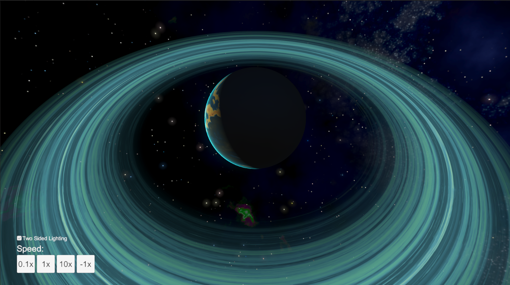
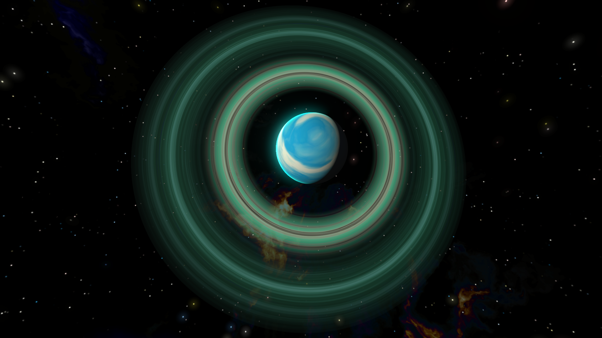

# Procedural Asteroid Rings

Inner and Outer Radius control the shape of the asteroid ring.

The patterns in asteroid rings are built by sampling a detailNoise texture assigned by default to each Procedural Asteroid Shader. As an advanced user, you can plug your own textures here to get different patterns.

## Lighting Override
The 2.1.2 update has added a variant asteroid ring shader, that exposes properties to control the way light interacts with the object.

- LightFalloffSharpness is a value that sits at a default of 0 for a Lit object, and increasing it makes the transition from light to dark when the directional light changes rotation sharper.
- MinBrightnessLevel determines how dark the ring gets when the light faces away from it.
- MinShadowBrightnessLevel determines how dark the ring gets when it is in the shadow of another object.
- The final two toggles are multi-compile boolean keywords necessary for the shader to receive shadows - they can be turned off to improve performance if shadows are not necessary.

### Two Sided Lighting
Consider the following situation with the light hitting the asteroid ring on the opposite side of the viewer:

The ring is unlit - very dark - the light value determined by the MinBrightnessLevel property.

But with TwoSidedLighting enabled, we get the absolute lighting value - thereby making it look as if the ring is illuminated from below.

## Advanced Effects

You can use two asteroid rings on the same parent gas giant to get a more varied effect:

/// caption
The ring is composed of two overlapping asteroid ring meshes, with the inner ring's outer radius slightly smaller than the outer ring's inner radius (repeat that 5 times, ha!).
///